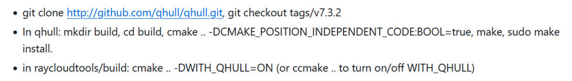
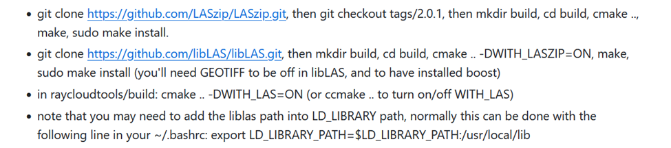

# Processing manual: TLS instance segmentation

Last update: 10/01/2025  
Questions/help: wout.cherlet@ugent.be

## Rayextract

### 1. Installation
We recommend running rayextract on a Linux desktop with sufficient memory.
RCT is already installed on CAVE012 on the common user Cavelab.


Instructions below are for the forked snapshot on the [Q-forestlab github](https://github.com/qforestlab/raycloudtools) (last update: 10/01/2025). The most recent version can be found at https://github.com/csiro-robotics/raycloudtools, but may not be consistent with this manual.

For custom installation, follow the instructions in the readme ([link](https://github.com/csiro-robotics/raycloudtools?tab=readme-ov-file#build-from-source-tested-on-linux-based-systems)).   
NOTE: make sure to first install qhull and add the corresponding flag for the cmake step of RCT:

NOTE: if using .laz files, install using the instructions below first and add the corresponding flag for the cmake step of RCT:

I recommend using WSL on Windows systems for smooth installation, but installation on Windows is likely possible as well. Alternatively, a Docker image is available, see instructions in the readme.

### 2. Execution

There are three steps: converting the point cloud to a ray cloud, extracting a terrain mesh, and extracting the trees.  
```
rayimport <input_name>.ply ray 0,0,-1 --max_intensity 0 --remove_start_pos
    (--remove_start_pos subtracts the geographic coordinates into local coordinates to avoid floating point precision issues. 
    It can be re-added later using raytranslate)
rayextract terrain <input_name>_raycloud.ply
rayextract trees <input_name>_raycloud.ply <input_name>_raycloud_mesh.ply
```

### 3. Output

Main output file is a .ply with the original point cloud, with individual tree predictions in a unique color. A python script is provided in the Q-forestlab repo to separate the colored trees into individual point clouds (requires open3d, conda environment available on cave012 named open3d):

```
python scripts/separate_instances.py -i <input_name>_raycloud_segmented.ply
    - (optional) -o/--odir: output directory to write separate instances to, defaults to <directory of input>/trees
    - (optional) -p/--prefix: prefix to give tree names, defaults to “tree”
```

Additionally, a .ply mesh and .txt file with the modeled trees is provided. This .txt file can be used with the [treetools toolset](https://github.com/csiro-robotics/treetools), e.g. to get volume or to add leaves.

## Deep learning-based algorithms

Benchmarking showed that rayextract obtains (near) best performance on most segmentation metrics at the time of writing. Additionally, it is very user-friendly and fast. If however you are still interested in using a deep learning-based algorithm like TreeLearn, you can contact me to see if we can use any of the pre-trained models. 